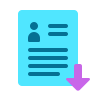
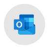

# Hello, I am Azad Alketaan ✋, a Software Engineer with expertise in Full-Stack web development.
## With a passion for building efficient, user-friendly, and scalable web applications, I made a name for myself in the industry.💪💪💪

## Here are some of my highlights:

🎓 I have a degree in the Faculty of Informatics Engineering (I.T.E), Specializing in Software Engineering, and have been coding since my undergraduate years.
 
💻 I have extensive experience with languages and frameworks like Laravel PHP, Node.js, and JavaScript, as well as front-end frameworks like React and Vue.JS.
 
🛠️ I am skilled in utilizing databases like MongoDB, PostgreSQL, and MySQL for efficient data storage and retrieval.
 
☁️ I am familiar with cloud platforms like AWS, Google Cloud, and Azure for the deployment and scaling of web applications.
 
🤝 I believe in collaborating with others to create high-quality software, which is why I have a strong passion for open-source development.

## Some of my projects include:

🌐 Awesome Portfolio: A user-friendly web application that showcases my projects and expertise in a visually appealing manner.
 
🛒 E-Commerce Store: A fully functional e-commerce store that allows users to browse products, add items to their cart, and complete their purchases.
 
🌱 GreenApp: An application that promotes environmentally friendly practices by providing users with information on recycling, reducing energy consumption, and sustainable transportation options.

👀 If you are looking for a highly skilled Full-Stack web developer who will be a valuable asset to your team, do not hesitate to get in touch with me.

## I am excited to embark on new projects and help your company grow.

## How to reach me
- My Resume: <a href="https://drive.google.com/file/d/14Brs-t3xfLuuO23iDg1vXDFWNLsf11iU/view?usp=drivesdk" download target="_blank">
   &nbsp;
</a>
📫 My Accounts: 
&nbsp;&nbsp;<a href="azad-kh@outlook.com">
  &nbsp;
</a><a href="https://www.linkedin.com/in/azadalketaan">
  &nbsp;
</a><a href="https://wa.me/963994274555">
  &nbsp;
</a><a href="https://www.facebook.com/azadalketaan">
  &nbsp;
</a><a href="https://stackoverflow.com/users/19115655/azad-alketaan">
  &nbsp;
</a>
<!---
AzadAlketaan/AzadAlketaan is a ✨ special ✨ repository because its `README.md` (this file) appears on your GitHub profile.
You can click the Preview link to take a look at your changes.
--->
